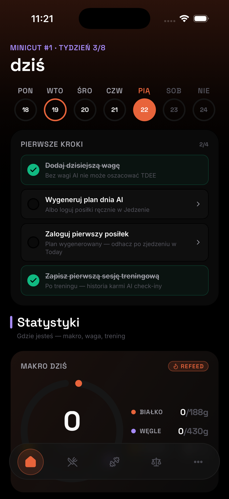
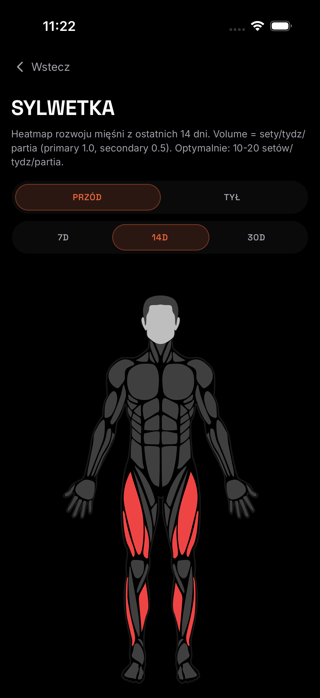

# [App Name] — AI Fitness & Nutrition Coach

> A mobile app that turns daily food and training logs into adaptive, science-grounded coaching — built around an AI layer engineered to be trustworthy, not just talkative.

> ⚠️ **Source code is private** as this is an actively developed product. The architecture and engineering decisions are described below; I'm happy to walk through the codebase or specific subsystems on request.

---

## Overview

[App Name] is a cross-platform iOS/Android app for tracking nutrition and strength training with an AI coach that adapts to the user over time. The focus of the project — and of this write-up — is the **engineering discipline behind the AI and data layers**: preventing hallucinations, staying useful offline, and keeping animations at 60fps.

---

## Tech Stack

**Mobile / Frontend**
- React Native (0.81) + Expo (SDK 54), file-based routing
- TypeScript (strict)
- NativeWind (Tailwind CSS for RN)
- Reanimated + Skia + react-native-svg (custom motion & GPU graphics)
- Victory Native (data visualization)

**Backend & Data**
- Supabase — PostgreSQL with Row-Level Security and `pgvector`
- TanStack Query for server-state + offline persistence
- Zustand for ephemeral client state
- Versioned SQL migrations (16)

**AI**
- Anthropic Claude (tiered: a stronger model for reasoning, a fast model for high-frequency calls)
- `pgvector` semantic memory
- Schema-validated structured output (Zod)

**Testing & QA**
- Jest + React Native Testing Library — 213 passing automated tests
- Maestro — end-to-end UI flows on release builds

**Tooling & Ops**
- GitHub Actions CI (unit + E2E pipelines)
- Husky + lint-staged pre-commit gates (TypeScript, formatting, tests)
- Sentry for crash & error monitoring

**External data**
- Open Food Facts + USDA nutrition databases for ground-truth cross-checks

---

## Architecture

### Trustworthy AI estimation layer
AI nutrition estimates are wrapped in several layers designed to fail safe rather than confidently lie:

- **Fallback cascade** — food estimation prefers structured, authoritative nutrition databases and only falls back to model inference when no reliable match exists, so the most accurate source available is always used first.
- **Quantified confidence** — every estimate carries an explicit numeric confidence, surfaced to the user and used downstream to decide how assertive the coaching should be.
- **Macro consistency validation** — a deterministic sanity layer checks each AI output for internal coherence (e.g. that reported macronutrients are physically consistent with the stated energy value) and flags or rejects implausible results before they ever reach the user. This catches a large class of model hallucinations without trusting the model to police itself.

### Three-layer AI memory
Coaching feels continuous without resending the full history on every call:
1. **Working context** — the immediate session.
2. **Structured facts** — durable, typed profile/goal state.
3. **Long-term semantic recall** — past interactions embedded and retrieved via `pgvector` similarity search.

This keeps prompts compact and cost-controlled while letting the assistant reference relevant history on demand.

### Offline-first with optimistic updates
The app is designed to be fully usable without connectivity:
- The query cache is persisted locally and rehydrated on launch.
- Mutations apply **optimistically** with automatic rollback on failure.
- The UI is network-state-aware, and local changes reconcile with the backend on reconnect.

### Safety & honesty by design
The coaching layer is engineered for honest, non-sycophantic feedback and includes guardrails for health-sensitive scenarios — prioritizing user wellbeing over engagement.

---

## Engineering Highlights

- **213 passing automated tests** across 17 suites — unit, domain logic, and "golden-set" evaluations for AI output quality.
- **End-to-end coverage** with Maestro running against release builds (critical user journeys).
- **CI/CD**: two GitHub Actions pipelines plus pre-commit gates that block any commit failing type-checks, formatting, or tests.
- **16 versioned, RLS-secured Postgres migrations** — every table protected at the database level.
- **~96 reusable UI components** across a file-routed app, with a consistent design system.
- **Bespoke motion system** built directly on Reanimated + Skia (no off-the-shelf animation kit): GPU-particle celebrations, a fluid traveling navigation indicator, spring-driven segmented controls and page indicators, and a procedural shader experiment — all running on the UI thread for 60fps.

---

## Key Challenges Solved

- **AI hallucination prevention** — combined the fallback cascade, quantified confidence, and deterministic macro-consistency validation so the system degrades gracefully instead of inventing numbers.
- **Offline-first sync** — optimistic mutations with rollback + persisted cache + reconnect reconciliation, so the app never blocks on the network.
- **ESM ↔ Metro/Hermes interop** — resolved bundler/runtime incompatibilities with ESM-only dependencies so modern packages run reliably under Hermes.
- **Animation performance** — moved physics and interpolation onto worklets to keep complex effects smooth without janking the JS thread.

---

## Screenshots

*Daily dashboard: macro progress, training week, and a focused navigation.*

*Weight trend with an AI insight that's validated before it's shown.*

*Per-muscle volume heatmap computed from logged sets over a rolling window.*

---

## Status

Actively developed. This repository is a public overview — **the implementation is private** to protect the product. Reach out if you'd like a guided walkthrough of any subsystem.
